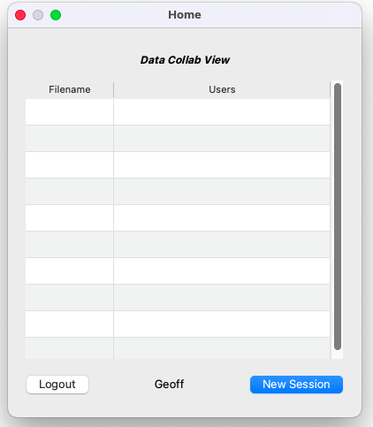
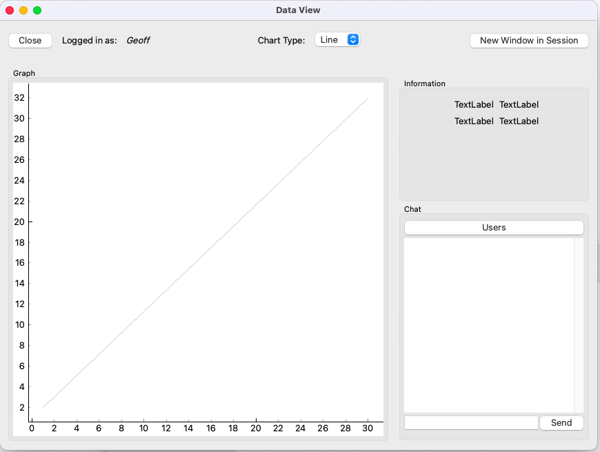
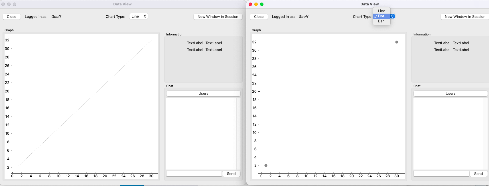
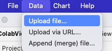
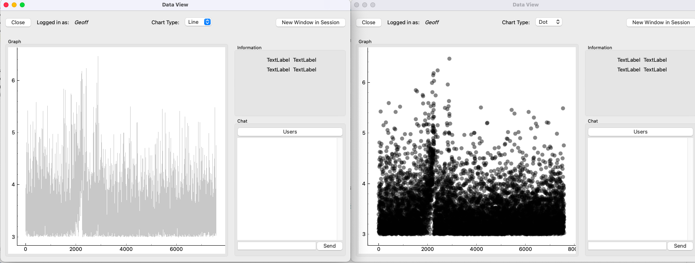
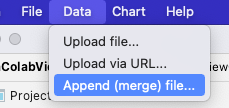
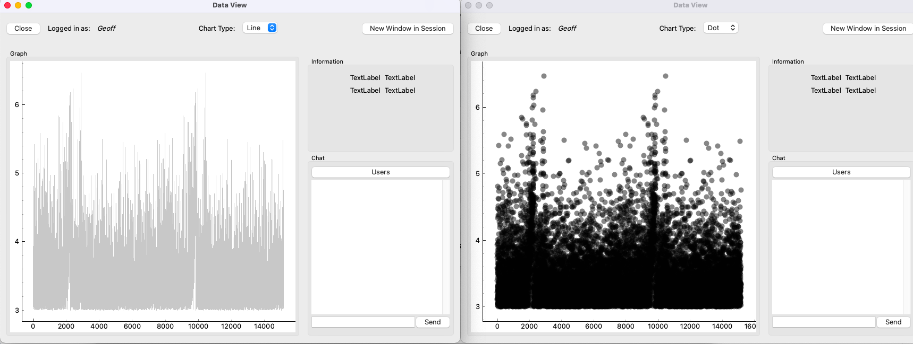
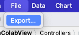

# PythonQtDataAnalysis

## or DataColabView

Install requirements using 

``pip install -r requirements.txt``

### Brief Guide

Click New Session

Click "New Window in session" to create a new view to view multiple graph types at the same time.

Change the graph type in the drop down.

Upload a csv

Append (merge) csv to the graph

Export graph data to CSV
